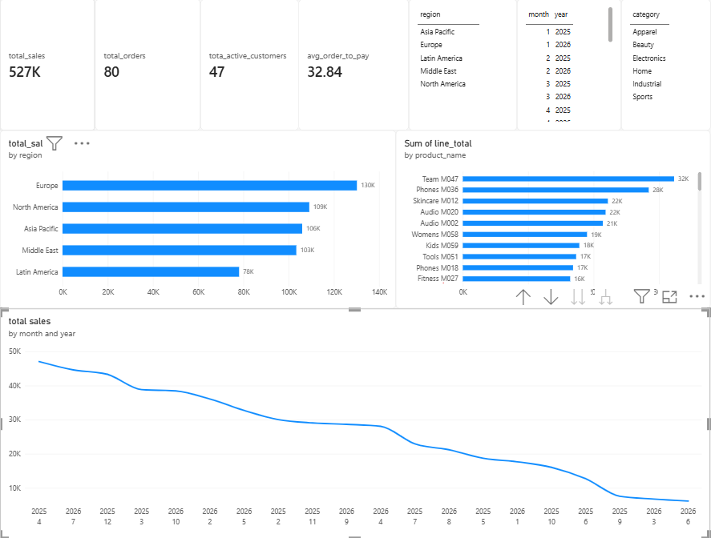
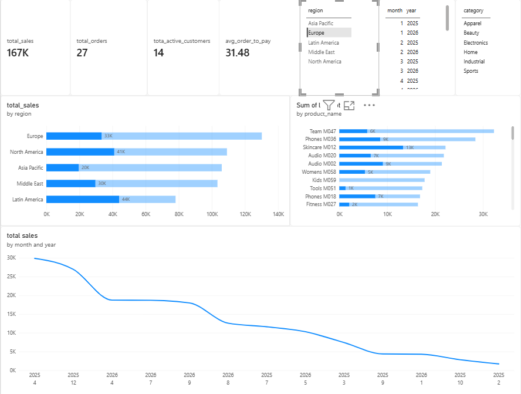

# Sales & Operations Analytics | Power BI

A Power BI portfolio project that brings sales, customers, products, inventory, campaigns, and order processing into a shared analytical model. The report explores sales performance across regions and products, with interactive selections for region, month/year, and category.

## Dashboard preview

## Business questions

- How much sales revenue is recorded, and how many orders contribute to it?
- Which regions and products contribute the most sales?
- How does sales performance vary across reporting months and years?
- How many customers are active, and what is the average time from order to payment?

## Project scope

The source workbook contains 23 worksheets spanning orders for 2025 and 2026, customer and product reference data, invoices, payments, shipments, inventory, campaign activity, exchange rates, sales targets, and regional security mappings.

The Power BI model organizes these sources into sales, inventory, campaign, order-process, and target fact tables, supported by customer, product, city, date, campaign, and order-flag dimensions. A dedicated measures table groups the report's KPI calculations.

**Tools:** Power BI Desktop, Power Query, DAX, and Excel source data.

## Data modeling

### Before modeling

### Analytical model

The model separates descriptive attributes from transactional data and includes relationships between fact and dimension tables. It also contains a regional security mapping table. Its presence alone does not establish that row-level security has been configured or tested.

## Report features

- KPI cards for total sales, total orders, active customers, and average order-to-payment time.
- Sales comparisons by region and product.
- Sales grouped by month and year.
- Interactive region, date, and category selections.

The selected view illustrates how selections change KPI values and highlight portions of the sales charts.

## Snapshot observations

In the overview screenshot, the report displays approximately **527K in sales**, **80 orders**, and **47 active customers**. The average order-to-payment card displays **32.84**; its unit and treatment of unpaid orders should be checked against the measure definition before interpreting it as a business KPI.

Europe has the largest displayed regional sales total, at approximately **130K**. Team M047 has the largest displayed product sales total, at approximately **32K**. These observations describe the saved screenshot and may change with filters or refreshed data. No currency is assumed because the screenshot does not identify one.

## Repository contents

| File | Purpose |
| --- | --- |
| `my_powerBI_end_to_end_project.pbix` | Power BI report and embedded analytical model |
| `dataset.xlsx` | Source workbook |
| `01_my_data_model_before_modeling.png` | Initial model screenshot |
| `02_my_data_model_after_data_modeling.png` | Analytical model screenshot |
| `03_my_visual.png` | Overview dashboard screenshot |
| `04_my_visual_filtred.png` | Dashboard with a selection applied |

## Open the project

1. Download or clone this repository.
2. Open `my_powerBI_end_to_end_project.pbix` in Power BI Desktop.
3. Explore the saved report using its interactive selections.
4. To refresh the data, update the Excel source path to your local `dataset.xlsx` through **Transform data → Data source settings → Change Source**, then apply changes and refresh. If a query contains a hardcoded path, update that query's Source step as well.

The screenshots provide a preview without requiring Power BI Desktop.

## Current limitations and next improvements

- The sales-by-month/year screenshot is sorted by sales amount. Sort by a chronological Year–Month key before using the chart to interpret changes over time.
- Improve displayed KPI and chart labels, including spelling and consistent units.
- Add an actual-versus-target chart and a target-achievement measure.
- Validate relationship behavior, KPI calculations, unpaid-order handling, and security roles before relying on the report for operational decisions.
- Confirm the source data's provenance and permission for public redistribution before publishing the workbook and embedded report data.

## Skills demonstrated

Multi-table data integration, fact and dimension modeling, relationship design, DAX KPI reporting, interactive report exploration, and visual documentation of a Power BI project.
