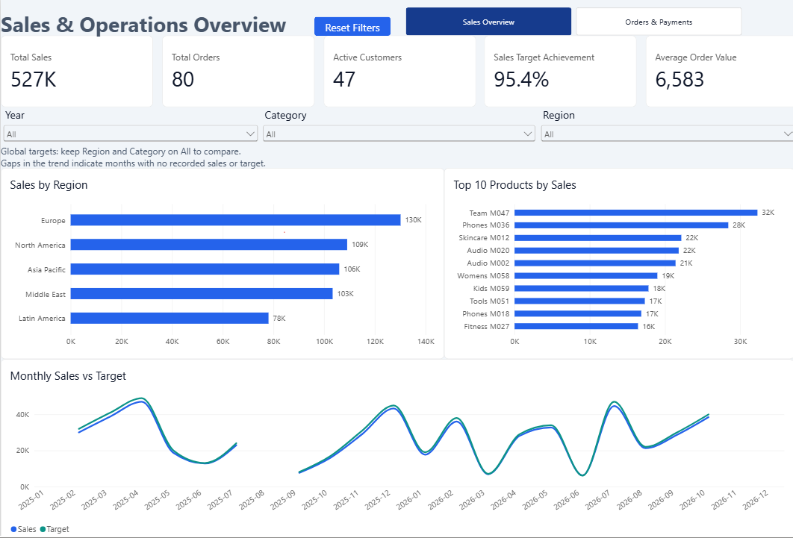
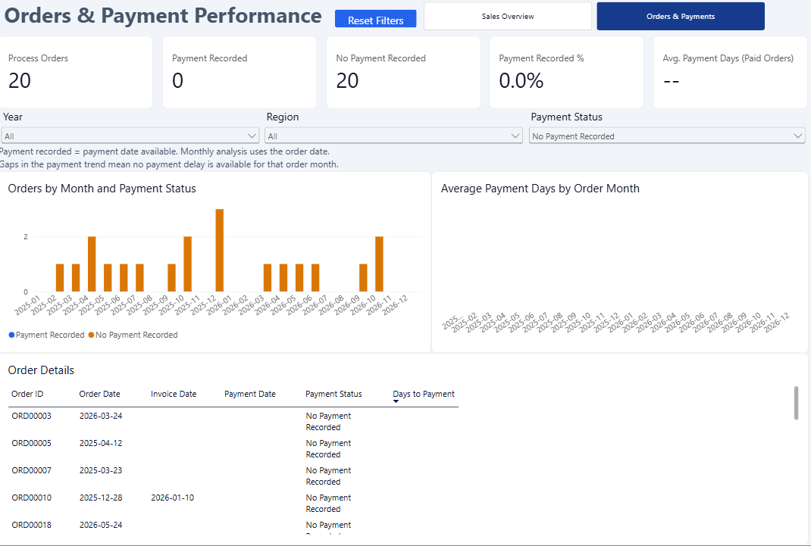
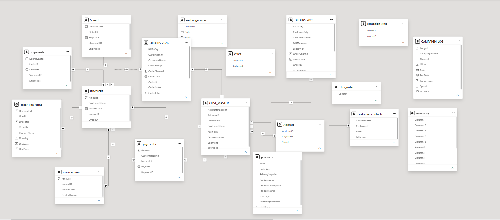
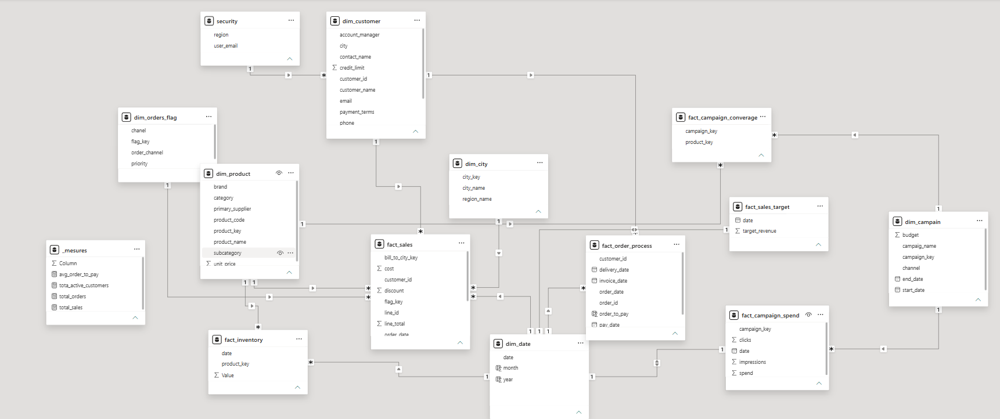

# Sales & Operations Analytics | Power BI

An interactive Power BI portfolio report for exploring sales performance and order-to-payment processing across 2025–2026. Version 2 combines a consistent visual theme with tested filters, KPI calculations, page navigation, and reset buttons.

## Sales Overview



This page compares sales with monthly targets and identifies leading regions and products. Year, customer region, and product category selectors support exploration.

| KPI | Overview value | Definition |
| --- | --- | --- |
| Total Sales | 526,643.91 | Sum of sales line totals |
| Total Orders | 80 | Distinct order IDs in the sales table |
| Active Customers | 47 | Value displayed by the report's active-customer measure |
| Sales Target Achievement | 95.4% | Sales divided by targets totaling 552,000 |
| Average Order Value | 6,583 | Sales divided by distinct orders, rounded for display |

Europe leads the displayed regional sales comparison at approximately 130K. Team M047 leads product sales at approximately 32K. Currency is not specified in the screenshots.

Targets are global monthly figures, not regional or category allocations. Target achievement and the target line are intentionally hidden when customer region or product category is filtered. Missing monthly values remain blank rather than being replaced with invented zero values.

## Orders & Payments


The page groups orders by their order month and allows filtering by year, customer region, and payment-date status. A detail table exposes order, invoice, and payment dates alongside the recorded delay.

| KPI | Overview value | Interpretation |
| --- | --- | --- |
| Process Orders | 80 | Distinct orders in the process table |
| Payment Recorded | 60 | Orders with a payment date |
| No Payment Recorded | 20 | Orders without a payment date |
| Payment Recorded % | 75.0% | Orders with a payment date divided by process orders |
| Average Payment Days | 32.8 | Average order-to-payment delay for rows with both dates |

Payment recorded means a payment date is present. It does not establish full settlement. A missing payment date does not establish overdue status. The average-delay tooltip includes the number of orders with payment recorded to help interpret small monthly samples.

### Investigating orders without a payment date



Selecting this status exposes 20 orders in the overview dataset. The delay average remains unavailable because these orders have no payment date. Count measures display zero when no matching orders exist.

## Data and model

The Excel source contains 23 worksheets covering orders, customers, products, invoices, payments, shipments, inventory, marketing campaigns, exchange rates, sales targets, and security mappings.

The analytical model includes fact tables for sales, inventory, campaigns, order processing, and targets; dimensions for customer, product, city, date, campaigns, and order flags; and a dedicated measures table.





The model images document the original modeling work. Version 2 additionally uses a date-only order column for the active relationship between the calendar and order processing, preserving original timestamps. The calendar filters monthly targets through an active, single-direction relationship. The security mapping table is present; configured and tested row-level security is not claimed.

## Selected DAX calculations

```dax
Average Order Value =
DIVIDE([total_sales], [total_orders])

Payment Recorded % =
DIVIDE([Paid Orders], [Process Orders])

Sales Target Overview =
IF(
    ISFILTERED(dim_customer[region])
        || ISFILTERED(dim_product[category]),
    BLANK(),
    [Sales Target]
)
```

Order-to-payment days use `DATEDIFF` in days, returning blank when either date is missing. The average ignores those blanks. Order counts use distinct order IDs; payment-status counts use `COALESCE` to display zero for an empty matching set.

## Validation performed during development

- Reconciled the displayed sales and target totals with a monthly validation table.
- Verified yearly and regional filters on the order KPIs.
- Checked 2025 totals: 40 orders, 27 with payment recorded, 13 without, and a 67.5% recorded-payment rate.
- Verified that the two payment-status groups reconcile to all 80 process orders.
- Tested status selections, unavailable averages, monthly chart interactions, and both reset buttons.
- Confirmed that clicking a stacked segment selects its month; the separate status selector narrows the payment-date status.
- Tested page navigation and retained a hidden Validation page for development checks.

These checks are focused report checks, not a comprehensive audit of the entire source dataset or all model relationships.

## Open the report

1. Download or clone this repository.
2. Open **my_powerBI_end_to_end_project_v2.pbix** in Power BI Desktop.
3. Start on Sales Overview and navigate to Orders & Payments.
4. Use the filters and Reset Filters button. In Desktop edit mode, use Ctrl + click to activate navigation and reset buttons.
5. To refresh, update the Excel source location to your local `dataset.xlsx` in Data source settings, or in a query's Source step if its path is hardcoded.

The original `my_powerBI_end_to_end_project.pbix` is retained as version 1. Screenshots allow visitors to preview version 2 without Power BI Desktop.

## Repository contents

| File | Purpose |
| --- | --- |
| `my_powerBI_end_to_end_project_v2.pbix` | Current two-page report and hidden Validation page |
| `my_powerBI_end_to_end_project.pbix` | Original report |
| `dataset.xlsx` | Excel source data |
| `03_SalesOverView_visualisation.png` | Version 2 sales overview |
| `04_orders&payments_visual.png` | Version 2 order and payment overview |
| `05_orders_without_payment.png` | Filtered investigation example |
| `01_my_data_model_before_modeling.png` | Initial model screenshot |
| `02_my_data_model_after_data_modeling.png` | Original analytical model screenshot |

## Limitations and next improvements

- Confirm source provenance, currency, and permission for redistribution; synthetic-data provenance has not been established here.
- Payment dates can extend beyond the current date. The report describes recorded dataset values rather than a verified live collection status.
- Customer-region filtering and sales-by-city-region grouping represent different geography roles; label and reconcile these roles before drawing detailed regional conclusions.
- Add tested profitability metrics once the cost grain and discount treatment are confirmed.
- Validate security roles before presenting row-level security as a completed feature.

## Skills demonstrated

Fact and dimension modeling, date relationship troubleshooting, DAX measures, KPI validation, interactive filtering, bookmarks, navigation, missing-data handling, and visual report design.
